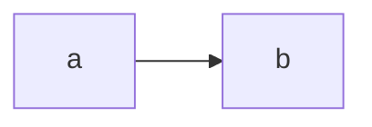
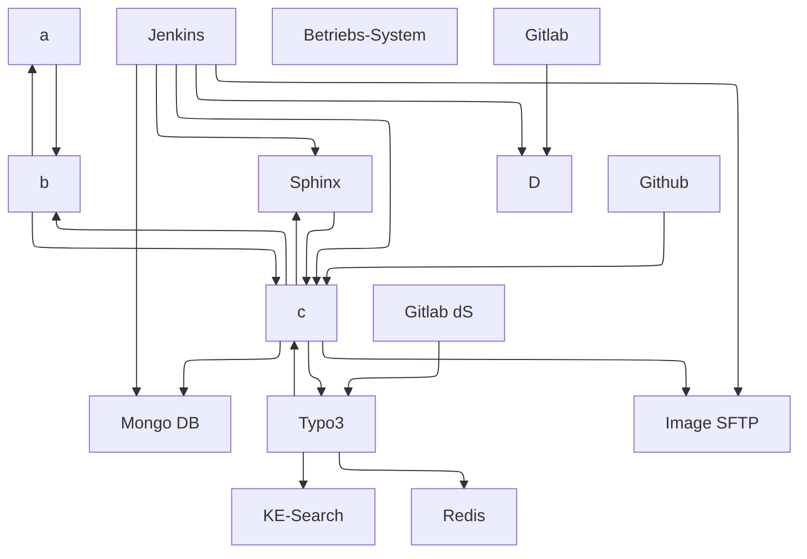
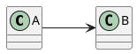

# diagram_test

<pre class="mermaid">
  %%{ init: { "flowchart": { "defaultRenderer": "elk" } } }%%

flowchart TD
  nav[a]
  nav --> bc
  bc[b]
  bc --> nav
  bc --> api2
  api2[c]
  api2 --> bc
  api2 --> mongo
  api2 --> sphinx
  api2 --> typo
  api2 --> sftp
  mongo[Mongo DB]
  sphinx[Sphinx]
  sphinx --> api2
  typo[Typo3]
  typo --> api2
  typo --> ke
  typo --> redis
  ke[KE-Search]
  jenkins[Jenkins]
  jenkins --> api2
  jenkins --> mongo
  jenkins --> sphinx
  jenkins --> api1
  jenkins --> sftp
  os[Betriebs-System]
  github[Github]
  github --> api2
  gitlab[Gitlab]
  gitlab --> api1
  api1[D]
  redis[Redis]
  gitlabds[Gitlab dS]
  gitlabds --> typo
  sftp[Image SFTP]
</pre>

